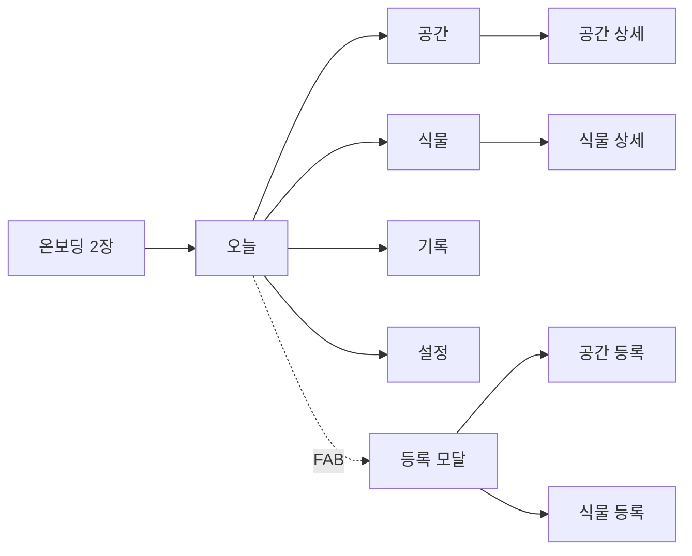
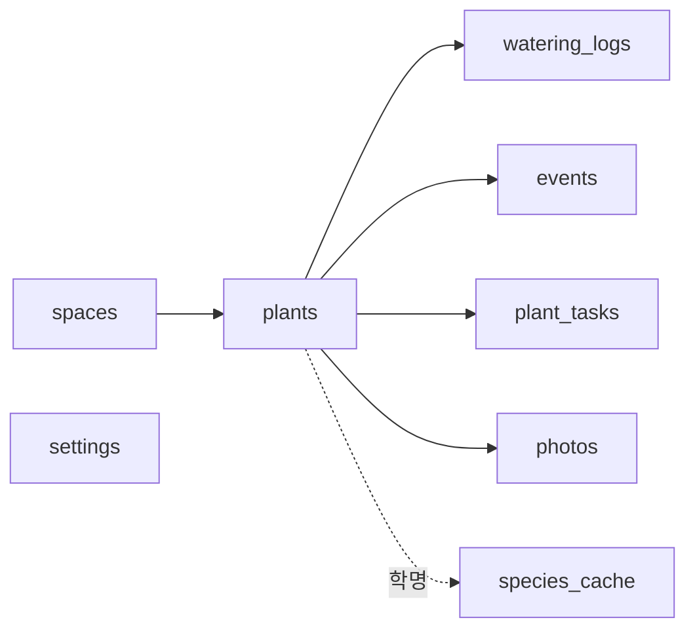

# 물때 (multtae) 기획서 v1.0 (배포 기준)

작성일 2026-09-20. 이 문서는 Claude Code가 구현할 때 참조하는 단일 명세다. 태스크 번호(예: 2-3)는 16장 로드맵 표를 가리킨다.

## 1. 제품 개요

내 집 공간(방향·창·테라스)을 AI가 읽고, 식물군·계절·화분에 맞춰 물주기를 계산해 알려주는 무료 앱. 분재를 포함한 모든 가정 식물을 다룬다. 첫 사용자는 나 자신이고, 완성되면 앱스토어·플레이스토어에 무료로 공개한다.

**작업명**: 물때 (물 줄 때, 물때가 됐다). 영문 슬러그 multtae.

### 핵심 원칙

| 원칙 | 의미 | 설계에 미치는 영향 |
| --- | --- | --- |
| 영구 무료 | 결제·구독·광고 없음 | 사용자당 변동비를 0에 가깝게: AI 호출은 종당 1회 캐시, 인식은 무료 API |
| 계정 없음 | 로그인 없이 즉시 시작 | 사용자 데이터는 기기 SQLite에만 저장, 서버에 개인 데이터 없음 |
| 사진 미저장 | 식물·공간 사진은 서버에 남기지 않음 | AI 판단용으로 1회 전송 후 폐기, 원본은 기기에만 |
| 결과만 간단히 | 언제, 며칠마다 주는지만 말함 | 식물 상세에 다음 물주기 날짜와 "7일마다 물을 줘요"만 표시. 계수 곱셈식은 화면에 내지 않고, 맞지 않으면 사용자가 주기를 직접 정함 |
| 흙이 우선 | 알림은 참고, 최종 판단은 흙 상태 | 물 준 뒤 흙 상태 3택 입력이 엔진을 학습시킴 |

### 기존 앱과의 차이

| 항목 | PictureThis / Planta | 물때 |
| --- | --- | --- |
| 시작점 | 식물을 등록 | 공간을 먼저 등록하고 식물을 놓음 |
| 환경 반영 | 실내/실외 2택 | 방향·창 크기·커튼·거리·발코니 확장·테라스를 AI가 사진에서 읽음 |
| 계절 | 북반구 4계절 | 한국 5구간 (봄·장마·폭염·가을·겨울난방) + 기상청 예보 |
| 분재 | 일반 식물과 동일 취급 | 전용 엔진, 흙 체크 알림, 수종군별 작업 캘린더, 월동 경고 |
| 가격 | 연 4~5만 원 구독 | 무료 |
| 학습 | 없음 | 흙 상태 피드백으로 식물별 주기 자동 보정 |

## 2. 타깃 사용자와 시나리오

1차 타깃은 아파트에서 식물 3~20개를 키우는 한국 성인이다. 분재 취미자는 소수지만 앱 충성도가 높아 초기 입소문의 핵심이다.

| 페르소나 | 상황 | 앱에서 얻는 것 |
| --- | --- | --- |
| 관엽 초보 | 몬스테라·스킨답서스 5개, 북향 거실, 과습으로 두 번 죽임 | 북향 저광이라 주기가 1.6배 늘어난다는 걸 등록 즉시 확인, 겨울 난방철 경고 |
| 분재 취미자 | 소나무·단풍 분재 8점, 남향 테라스 | 여름 아침·저녁 흙 체크 알림, 5월 순따기·2월 분갈이 캘린더, 한파 예보 시 대피 알림 |
| 테라스 가드너 | 허브·초화 15개, 서향 발코니 확장 | 폭염 구간 주기 0.5배, 장마철 과습 경고, 비 예보 날 알림 자동 건너뜀 |

### 대표 시나리오

**시나리오 A: 첫 등록 (3분)**

1. 앱 실행, 온보딩 2장 넘김, 계정 없이 시작.
2. 거실 창가 사진 촬영 → 남향 선택 → 실내 창가 선택 → AI가 "중광 (커튼 있음, 창에서 1m)" 제안 → 확인.
3. 몬스테라 사진 촬영 → 후보 3개 중 선택 → 열대 관엽으로 자동 분류 → 화분 중형 → 배양토 → 거실 창가 배치.
4. "다음 물주기 9월 27일, 7일마다 물을 줘요" 표시. 알림 시각 기본 오전 8시.

**시나리오 B: 물 주는 날**

1. 오전 8시 알림 "몬스테라 물 줄 때예요".
2. 앱 열면 오늘 탭에 몬스테라 카드. 물 주고 "물 줬어요" 탭.
3. 흙 상태 3택 "아직 축축했어요" 선택 → 이 식물 주기 +15% → 다음 알림 8일 뒤로 재계산.

**시나리오 C: 계절 전환**

1. 11월 16일 0시, 앱이 겨울 모드로 전환. 오늘 탭 상단 배지 "겨울·난방 모드".
2. 모든 식물 다음 물주기 재계산, 잡목 분재가 실내 공간에 있으면 "실외 월동 필요" 경고 카드.
3. 다육이는 주기 2.5배로 늘어나 "12월까지 물 안 줘도 됩니다" 안내.

## 3. 화면 구조와 명세

하단 탭 4개(오늘·공간·식물·기록)와 설정, 그리고 모달로 뜨는 등록 플로우로 구성한다.



등록은 어느 탭에서든 우하단 + 버튼으로 진입한다.

### 3.1 온보딩 (첫 실행 1회)

| 요소 | 내용 |
| --- | --- |
| 1장 | "공간을 먼저 알려주세요. 식물은 그다음이에요." 한 줄 + 일러스트 |
| 2장 | 알림 권한 요청 (거부해도 진행), 카메라 권한은 등록 시점에 요청 |
| 종료 | 바로 공간 등록 플로우로 진입. 건너뛰기 가능 |

### 3.2 오늘 탭 (홈)

| 영역 | 요소 | 동작 |
| --- | --- | --- |
| 상단 배지 | 현재 계절 모드 (봄 / 장마 / 폭염 / 가을 / 겨울·난방) + 오늘 날씨 아이콘 | 탭하면 계절 설명 시트 |
| 경고 카드 | 한파·폭염·서리 예보, 월동 필요, 미세먼지 나쁨 | 닫기 가능, 당일만 표시 |
| 밀림 섹션 | 예정일 지난 식물, 빨간 점, 지난 일수 표시 | 카드 탭 → 물 줬어요 시트 |
| 오늘 섹션 | 오늘 물 줄 식물 카드 (사진·별명·공간명) | 스와이프로 "물 줬어요" / "내일로" |
| 분재 체크 | 분재는 "흙 확인" 카드로 별도 표시 | 탭 → 말랐음(물 줌) / 아직 촉촉 |
| 다가옴 | 3일 내 예정 식물 목록 | 탭 → 식물 상세 |
| 빈 상태 | 식물 0개면 "첫 공간을 등록해보세요" CTA | 등록 플로우 진입 |

**물 줬어요 시트**: 흙 상태 3택 (바싹 말랐음 / 적당했음 / 아직 축축했음) + 선택 항목 "잎이 처졌어요" 체크 + 완료. 흙 상태는 건너뛸 수 있고 건너뛰면 "적당"으로 기록.

### 3.3 공간 탭

| 요소 | 내용 |
| --- | --- |
| 공간 카드 | 사진 썸네일, 이름, 방향 아이콘, 유형, 빛 등급, 식물 수 |
| 공간 상세 | 큰 사진, AI 판단 근거 문장, 빛 등급 수정 버튼, 이 공간의 식물 그리드, 재촬영 버튼 |
| 계절 메모 | 유형별 자동 문구 (예: 발코니 확장은 12~2월 새벽 5도 이하 가능) |

### 3.4 식물 탭

| 요소 | 내용 |
| --- | --- |
| 목록 | 전체 식물 카드, 정렬: 다음 물주기순 / 공간별 / 이름순, 필터: 분재만 |
| 식물 상세 상단 | 대표 사진, 별명, 학명·국명, 식물군 뱃지, 분재 뱃지, 공간명 |
| 다음 물주기 | 날짜 + D-day + 흙 게이지 + 주기 한 줄 "8일마다 물을 줘요" + 마지막 물 준 날 + 물 줬어요 버튼. 계산식과 계수는 보여 주지 않는다 |
| 관리 카드 | 빛·물·습도·온도·흙 5개 항목 (종 DB에서), 접기 가능 |
| 작업 캘린더 | 분재만: 이번 달 작업, 다음 작업 D-day |
| 이력 | 최근 물주기 5건 + 흙 상태, 더보기 → 기록 탭 |
| 편집 | 정보 줄을 눌러 시트에서 고침: 공간 이동, 분갈이(화분 크기·흙), 물주기(자동 / 직접 정하기 1~60일, 되돌리기), 별명. 저장하면 바로 다시 세고 알림도 다시 예약. 삭제는 확인 창을 거침 |

### 3.5 기록 탭

| 요소 | 내용 |
| --- | --- |
| 타임라인 | 날짜별 물주기·비료·분갈이·진단 이벤트, 식물 필터 |
| 통계 | 식물별 실제 평균 주기 vs 계산 주기, 최근 30일 밀림 횟수 |
| 사진 타임랩스 | 식물별 성장 사진 슬라이더 (2차) |

### 3.6 설정

| 항목 | 값 |
| --- | --- |
| 알림 시각 | 기본 08:00, 분재 저녁 체크 기본 19:00 |
| 방해금지 | 시작·종료 시각 |
| 지역 | 시·군·구 선택 (기상청 예보용, 위치 권한 대신 수동 선택) |
| 난방 시즌 | 자동(11/16~2/28) 또는 수동 날짜 |
| 데이터 | 내보내기(JSON), 가져오기, 전체 삭제 |
| 정보 | 개인정보처리방침, 오픈소스 라이선스, 버전, 피드백 메일 |

## 4. 등록 플로우

공간 등록 4단계, 식물 등록 6단계. 모든 단계는 뒤로 가기 가능하고 중간 이탈 시 임시 저장한다.

### 4.1 공간 등록


| 단계 | 입력 | 규칙 |
| --- | --- | --- |
| 1 사진 | 카메라 또는 앨범, 가로 권장 안내 "창이 보이게 찍어주세요" | 사진은 기기에 저장, AI 판단용 1회 업로드 후 서버 폐기 |
| 2 방향 | 남 / 동 / 서 / 북 / 모름 4+1 버튼, 나침반 아이콘으로 기기 방위 자동 제안 | 모름이면 중광으로 가정하고 경고 표시 |
| 3 유형 | 실내 창가 / 발코니 확장 / 테라스·옥외 / 창에서 먼 실내 | 유형은 공간 계수와 월동 규칙을 결정 |
| 4 빛 등급 | AI 결과 카드: 등급(강광·중광·약광·저광) + 근거 문장 2줄 + 수정 버튼 | AI 실패 시 방향+유형 조합표로 기본값 산출 |
| 저장 | 이름 자동 제안 (예: 남향 거실 창가), 수정 가능 | 공간 최대 20개 |

**AI 실패 시 기본값 표** (방향 × 유형)

| 방향 | 실내 창가 | 발코니 확장 | 테라스·옥외 | 창에서 먼 실내 |
| --- | --- | --- | --- | --- |
| 남 | 강광 | 강광 | 강광 | 약광 |
| 동 | 중광 | 중광 | 강광 | 약광 |
| 서 | 중광 | 강광 | 강광 | 약광 |
| 북 | 약광 | 약광 | 중광 | 저광 |
| 모름 | 중광 | 중광 | 강광 | 저광 |

### 4.2 식물 등록


| 단계 | 입력 | 규칙 |
| --- | --- | --- |
| 1 사진 | 카메라/앨범, 잎이 잘 보이게 안내, 사진 최대 3장 | PlantNet은 잎·꽃·열매·줄기 중 부위를 태그하면 정확도 오름, 기본 leaf |
| 2 종 선택 | 후보 3개 카드 (국명·학명·신뢰도%), "직접 검색" 텍스트 입력, "모르겠어요" | 신뢰도 30% 미만이면 후보 대신 검색 유도. 모르겠어요 → 식물군만 직접 선택 |
| 3 화분 | 소(12cm 이하) / 중(13~20) / 대(21~30) / 특대(30 초과), 손바닥 비교 일러스트 | 기본값 중 |
| 4 흙 | 일반 배양토 / 마사 섞음 / 적옥토·분재용 / 수경 | 수경은 물주기 알림 대신 물 교체 7일 고정 |
| 5 공간 | 등록된 공간 카드 선택, 없으면 여기서 공간 등록으로 분기 | 필수 |
| 6 분재 | 토글. 켜면 수종군(침엽 / 잡목 / 화목·실물) 선택 | 종 DB에 bonsai_group이 있으면 자동 선택 |
| 완료 | 별명 입력(기본값 국명), 첫 물주기 날짜와 주기 한 줄("7일마다 물을 줘요") 표시, 마지막 물 준 날 입력(기본 오늘) | 식물 최대 200개 |

**종 선택 후 자동 매핑**: 종 DB에서 식물군·기본 주기·관리 카드를 가져온다. DB에 없는 종이면 Edge Function이 LLM으로 1회 생성해 DB에 저장하고 반환한다(30초 이내, 실패 시 식물군만 선택하게 하고 나중에 재시도).

## 5. 물주기 엔진

주기는 기본 주기에 6개 계수를 곱해 계산하고, 최종값은 1일~60일 사이로 자른다. 모든 계수는 코드 상수가 아니라 Supabase의 `coefficients` 테이블에서 읽어 앱 업데이트 없이 조정할 수 있게 한다.

```
I = clamp(B × S[g][s] × P × L × T × M × U, 1, 60)
```

| 기호 | 의미 | 출처 |
| --- | --- | --- |
| B | 식물군 기본 주기 (일) | 종 DB (종별 값 있으면 우선, 없으면 식물군 기본값) |
| S | 계절 계수 (식물군 g × 계절 s) | 5.2 표 |
| P | 화분 계수 | 5.3 표 |
| L | 빛 계수 | 공간의 빛 등급 |
| T | 공간 유형 계수 | 공간 유형 |
| M | 흙 계수 | 흙 종류 |
| U | 학습 보정 | 식물별, 0.5~2.0, 초기값 1.0 |

다음 물주기 = 마지막 물 준 날 + round(I). 반올림은 0.5 이상 올림.

### 5.1 식물군과 기본 주기

봄, 중광, 중형 화분, 배양토, 실내 기준.

| 코드 | 식물군 | 예시 | B (일) |
| --- | --- | --- | --- |
| succulent | 다육·선인장 | 에케베리아, 하월시아, 산세베리아, 선인장 | 14 |
| tropical | 열대 관엽 | 몬스테라, 필로덴드론, 고무나무, 스킨답서스, 칼라데아 | 7 |
| temperate | 온대 관엽·실내수목 | 벤자민, 올리브, 홍콩야자, 아이비, 율마, 유칼립투스 | 6 |
| herb | 허브·초화·채소 | 바질, 로즈마리, 제라늄, 페튜니아, 상추 | 3 |
| bonsai_conifer | 침엽 분재 | 소나무, 흑송, 향나무, 진백, 주목 | 2 |
| bonsai_deciduous | 잡목·화목 분재 | 단풍, 느티, 소사, 명자, 철쭉, 모과 | 1.5 |

### 5.2 계절 계수 S

| 식물군 | 봄 | 장마 | 폭염 | 가을 | 겨울·난방 |
| --- | --- | --- | --- | --- | --- |
| succulent | 1.0 | 1.5 | 1.2 | 1.0 | 2.5 |
| tropical | 1.0 | 1.3 | 0.7 | 1.0 | 1.6 |
| temperate | 1.0 | 1.3 | 0.7 | 1.0 | 1.8 |
| herb | 1.0 | 1.2 | 0.5 | 1.0 | 1.5 |
| bonsai_conifer | 1.0 | 1.3 | 0.5 | 1.0 | 1.5 |
| bonsai_deciduous | 1.0 | 1.2 | 0.5 | 1.0 | 2.0 |

**계절 경계** (기본값, 설정에서 수동 조정 가능, 2차에서 기상청 장마 발표로 대체)

| 계절 | 코드 | 시작 | 종료 |
| --- | --- | --- | --- |
| 봄 | spring | 3월 1일 | 6월 20일 |
| 장마 | monsoon | 6월 21일 | 7월 25일 |
| 폭염 | heat | 7월 26일 | 8월 31일 |
| 가을 | autumn | 9월 1일 | 11월 15일 |
| 겨울·난방 | winter | 11월 16일 | 2월 28일 (윤년은 29일) |

계절이 바뀌는 날 0시에 모든 식물의 다음 물주기를 재계산한다. 마지막 물 준 날 기준으로 다시 계산하므로 남은 일수가 늘거나 줄 수 있다.

### 5.3 화분·빛·공간·흙 계수

| 계수 | 값 |
| --- | --- |
| P 화분 | 소(s) 0.7 / 중(m) 1.0 / 대(l) 1.3 / 특대(xl) 1.6 |
| L 빛 | 강광(high) 0.8 / 중광(medium) 1.0 / 약광(low) 1.3 / 저광(very_low) 1.6 |
| T 공간 유형 | 실내 창가(indoor_window) 1.0 / 창에서 먼 실내(indoor_far) 1.0 / 발코니 확장(balcony_ext) 0.9 / 테라스·옥외(terrace) 0.7 |
| M 흙 | 배양토(potting) 1.0 / 마사 섞음(gritty) 0.8 / 적옥토·분재용(akadama) 0.6 / 수경(hydro) 고정 7일 |

창에서 먼 실내는 빛 계수(저광 1.6)에서 이미 반영되므로 공간 유형 계수는 1.0으로 둔다.

### 5.4 학습 보정 U

물 줄 때 입력한 흙 상태로 식물별 U를 갱신한다.

| 입력 | U 변화 | 비고 |
| --- | --- | --- |
| 아직 축축했음 (wet) | ×1.15 | 과습 방향, 주기 늘림 |
| 적당했음 (ok) | 유지 | 기본값 |
| 바싹 말랐음 (dry) | ×0.85 | 건조 방향, 주기 줄임 |
| 잎이 처졌어요 체크 (leaf_droop) | 추가 ×0.9 | 바싹 말랐음과 함께면 총 ×0.77 |

규칙: U는 0.5~2.0 범위로 자른다. 같은 방향 입력이 3회 연속이면 식물 상세에 "이 식물은 계산보다 물을 (덜/더) 원해요" 안내를 띄우고, 사용자가 원하면 주기를 수동 고정할 수 있다. 계절이 바뀌어도 U는 유지한다(U는 이 집·이 화분의 고유 특성이라고 본다).

### 5.5 엣지케이스

| 상황 | 처리 |
| --- | --- |
| 밀린 식물에 물 줌 | 마지막 물 준 날을 오늘로 갱신, 밀린 일수는 학습에 반영하지 않음 |
| "내일로" 미루기 | 다음 물주기 +1일, 최대 3회 연속(`coefficients.max_postpones`), 이후 밀림으로 표시. 물을 주면 횟수는 0으로 돌아감 |
| 마지막 물 준 날 모름 | 등록 시 "모름" 선택하면 오늘로 두고 첫 알림을 I/2일 뒤에 줌 |
| 공간 이동 | 식물의 공간 변경 즉시 재계산, U 유지 |
| 화분 크기 변경 (분갈이) | 재계산, U를 1.0으로 리셋(흙이 바뀌었으므로) |
| 계산 결과 1일 미만 | 1일로 고정하고 분재가 아니면 "매일 흙 확인" 문구 |
| 수경 | 계수 무시, 물 교체 7일 고정, 흙 상태 대신 "물이 탁했어요" 1택 |
| 주기 수동 고정 | 사용자가 N일 입력하면 엔진 계산 중지, 계절 전환 시 "자동으로 돌릴까요?" 1회 질문 |

### 5.6 계산 예시 (테스트 케이스)

| 식물 | 조건 | 계산 | 결과 |
| --- | --- | --- | --- |
| 몬스테라 | 가을, 중형, 북향 실내 창가(약광), 배양토, U 1.0 | 7 × 1.0 × 1.0 × 1.3 × 1.0 × 1.0 × 1.0 = 9.1 | 9일 |
| 같은 몬스테라 | 겨울·난방 | 7 × 1.6 × 1.0 × 1.3 × 1.0 × 1.0 × 1.0 = 14.56 | 15일 |
| 에케베리아 | 겨울, 소형, 남향 창가(강광), 배양토 | 14 × 2.5 × 0.7 × 0.8 × 1.0 × 1.0 × 1.0 = 19.6 | 20일 |
| 흑송 분재 | 폭염, 중형, 남향 테라스(강광), 적옥토 | 2 × 0.5 × 1.0 × 0.8 × 0.7 × 0.6 × 1.0 = 0.336 | 1일 + 아침·저녁 체크 |
| 단풍 분재 | 겨울, 대형, 테라스(강광), 적옥토 | 1.5 × 2.0 × 1.3 × 0.8 × 0.7 × 0.6 × 1.0 = 1.31 | 1일 (흙 체크 알림) |
| 바질 | 폭염, 소형, 서향 발코니 확장(강광), 배양토 | 3 × 0.5 × 0.7 × 0.8 × 0.9 × 1.0 × 1.0 = 0.756 | 1일 |

## 6. 분재 모드

분재 토글을 켜면 같은 엔진을 쓰되 알림 방식·작업 캘린더·월동 규칙 3가지가 달라진다.

### 6.1 알림 방식

| 항목 | 일반 식물 | 분재 |
| --- | --- | --- |
| 문구 | "물 줄 때예요" | "흙 확인할 때예요" |
| 응답 | 물 줬어요 / 내일로 | 말랐음(물 줌) / 아직 촉촉(내일 다시) |
| 폭염 구간 | 1일 1회 | 아침 08:00 + 저녁 19:00 2회 |
| 학습 | 흙 상태 3택 | 촉촉 응답 자체가 ×1.15, 말랐음은 유지 |

### 6.2 수종군별 작업 캘린더

종 DB의 `bonsai_tasks`에 저장되고 등록 시 식물별 캘린더로 복사된다. 각 작업은 시작·종료 월과 문구를 가지며, 시작 월 1일 오전에 알림 1회 + 오늘 탭 카드로 표시한다.

| 수종군 | 작업 코드 | 작업 | 시기 | 알림 문구 |
| --- | --- | --- | --- | --- |
| conifer (소나무·흑송) | pinch_candles | 순따기·순자르기 | 5~6월 | 새순이 3cm 넘으면 손으로 꺾어 주세요 |
| conifer (소나무·흑송) | pull_old_needles | 묵은 잎 뽑기 | 10~11월 | 2년 된 잎을 뽑아 통풍을 확보하세요 |
| conifer (소나무·흑송) | wiring | 철사걸이 | 11~2월 | 휴면기라 가지가 유연합니다 |
| conifer (소나무·흑송) | repot | 분갈이 | 3월 | 새순 나오기 직전, 2~4년 주기 |
| conifer (향나무·진백) | pinch_tips | 순집기 | 4~9월 | 웃자란 순을 수시로 집어 주세요 |
| conifer (향나무·진백) | repot | 분갈이 | 3~4월 | 3~5년 주기 |
| deciduous (단풍·느티·소사) | repot | 분갈이 | 2~3월 | 싹 트기 전, 1~2년 주기 |
| deciduous (단풍·느티·소사) | defoliate | 잎자르기 | 6월 | 건강한 나무만, 잔가지를 늘립니다 |
| deciduous (단풍·느티·소사) | prune | 가지치기 | 11~12월 | 낙엽 후 수형 정리 |
| flowering (명자·철쭉·모과) | prune_after_bloom | 꽃 후 전정 | 꽃 진 직후 (수종별 4~6월) | 꽃눈 분화 전에 정리하세요 |
| flowering (명자·철쭉·모과) | repot | 분갈이 | 꽃 후 또는 3월 | 2~3년 주기 |
| 전체 | fertilize | 비료 | 4~6월, 9~10월 | 유기질 고형비료 월 1회, 장마·폭염·겨울 중단 |

작업 완료는 기록 탭에 남고, 분갈이 완료 시 U를 1.0으로 리셋한다.

### 6.3 월동 규칙

| 조건 | 경고 | 시점 |
| --- | --- | --- |
| 잡목 분재가 실내 창가 또는 창에서 먼 실내에 배치 | "단풍·느티 같은 잡목은 실내 월동 시 휴면을 못 해 약해집니다. 발코니나 테라스로 옮기세요" | 11월 16일 계절 전환 시 |
| 침엽 분재가 실내 | "소나무·향나무는 실외 월동이 원칙입니다. 난방 없는 곳으로" | 11월 16일 |
| 테라스 분재 + 한파 예보 (최저 −5도 이하) | "화분이 얼 수 있어요. 발코니 안쪽이나 스티로폼 상자로 보호하세요" | 예보 당일 오전 |
| 테라스 분재 + 서리 예보 (10~11월, 3~4월) | "첫서리·늦서리 주의, 새순이 상할 수 있어요" | 예보 당일 |
| 발코니 확장 + 한파 | "확장 발코니는 새벽에 5도 아래로 떨어질 수 있어요" | 예보 당일 |
| 겨울 물주기 시각 | 분재 알림을 08:00에서 11:00으로 자동 이동 (설정에 별도 항목) | 겨울 구간 |

겨울 물주기 시각을 늦추는 이유는 오전 중 기온이 올라야 화분 속 물이 얼지 않기 때문이다.

## 7. 한국 환경 기능

기상청 단기예보 API(공공데이터포털, 무료)를 하루 2회 호출해 테라스·발코니 식물의 알림을 조정하고 경고 카드를 띄운다. 위치 권한은 받지 않고 설정에서 시·군·구를 고르게 한다.

### 7.1 기상청 연동

| 항목 | 값 |
| --- | --- |
| API | 기상청 단기예보 조회서비스 (getVilageFcst), 공공데이터포털 인증키, 일 1,000건 무료 |
| 호출 | 앱이 Edge Function `weather` 호출 → 서버가 격자 좌표로 변환해 기상청 호출 → 24시간 예보 요약 JSON 반환. 서버가 지역별로 3시간 캐시해 사용자 수와 무관하게 호출량 고정 |
| 시각 | 06:00, 18:00 백그라운드 fetch. 실패 시 이전 값 유지, 48시간 넘게 실패하면 날씨 기능 비활성 표시 |
| 데이터 | 최저·최고기온, 강수확률, 강수량, 하늘상태, 풍속 |
| 미세먼지 | 에어코리아 대기오염정보 API(공공데이터포털), 같은 Edge Function에서 함께 반환 |

### 7.2 날씨 규칙

테라스·옥외와 발코니 확장(창 연 상태 가정) 공간의 식물에만 적용한다. 실내 창가·먼 실내는 경고 카드만 받는다.

| 조건 | 대상 | 동작 |
| --- | --- | --- |
| 오늘 강수확률 70% 이상 + 강수량 5mm 이상 | 테라스·옥외 | 오늘 물주기 알림 자동 건너뜀, 마지막 물 준 날을 오늘로 갱신하고 "비가 대신 줬어요" 기록 (source=rain) |
| 최고기온 33도 이상 | 테라스·옥외, 발코니 확장 | 알림 시각을 07:00으로 당김, 오늘 탭 "폭염, 저녁에 흙 한 번 더 확인" 카드 |
| 최저기온 −5도 이하 | 테라스·옥외, 발코니 확장 | 한파 경고 카드, 분재는 6.3 월동 규칙 문구 |
| 최저기온 3도 이하 (10~11월, 3~4월) | 테라스·옥외 | 서리 경고 카드 |
| 풍속 10m/s 이상 | 테라스·옥외 | "강풍, 화분 넘어짐 주의" 카드, 소형 화분 있으면 강조 |
| 미세먼지 나쁨 이상 | 전체 | "환기 어려운 날, 잎에 물 분무로 습도 보충" 팁 카드 (열대 관엽 있을 때만) |

### 7.3 난방 시즌

겨울·난방 구간(11/16~2/28)에 실내 공간의 열대·온대 관엽 식물에 적용한다.

| 동작 | 내용 |
| --- | --- |
| 계수 | 5.2 표의 겨울 계수가 이미 반영. 별도 계수 없음 |
| 습도 카드 | 오늘 탭에 주 1회(월요일) "난방으로 실내 습도 30% 이하일 수 있어요. 잎 끝이 마르면 가습기나 물 분무" |
| 온풍 경고 | 공간 상세에 "온풍기·라디에이터 옆은 피하세요" 고정 문구 (겨울 구간만) |
| 수동 조정 | 설정에서 난방 시작·종료 날짜를 바꾸면 계절 경계도 함께 이동 |

### 7.4 장마

| 동작 | 내용 |
| --- | --- |
| 계수 | 5.2 표 장마 열 적용 |
| 과습 카드 | 장마 시작일 "장마 동안은 흙이 마른 걸 확인하고 주세요. 받침 물은 바로 버리세요" |
| 통풍 카드 | 테라스·발코니 공간에 "비 들이치면 실내로" 안내 |
| 2차 | 기상청 장마 시작·종료 발표를 받아 경계 자동 갱신 (1차는 고정 날짜) |

## 8. 진단·비료·분갈이·기록

무료를 유지하기 위해 진단은 기기당 하루 3회로 제한하고, 비료·분갈이는 서버 호출 없이 종 DB 규칙만으로 돌린다.

### 8.1 병해충·상태 진단

| 항목 | 내용 |
| --- | --- |
| 진입 | 식물 상세 "상태 진단" 버튼, 사진 1~3장 |
| 처리 | Edge Function `diagnose` → Claude 비전 → 9.3 JSON 스키마로 반환 |
| 결과 화면 | 진단명(최대 2개, 확신도), 원인 추정, 지금 할 일 3개, 경과 관찰 기간, "3일 뒤 다시 확인" 알림 등록 버튼 |
| 엔진 연동 | 결과에 `watering_hint`가 over/under면 U에 ×1.15 / ×0.85 적용 여부를 사용자에게 묻고 반영 |
| 한도 | 기기당 하루 3회, 초과 시 "내일 다시" 안내. 한도는 `coefficients.diagnose_daily_limit`로 조정 |
| 기록 | 사진 썸네일(기기 저장)과 진단 요약을 기록 탭 이벤트로 저장 |
| 면책 | 결과 하단 고정 문구 "AI 추정이며 정확하지 않을 수 있어요" |

### 8.2 비료 알림

종 DB `fertilizer` 규칙(빈도·시기)으로 계산하고 물주기와 같은 날에 묶어 알린다.

| 식물군 | 시기 | 빈도 | 문구 |
| --- | --- | --- | --- |
| tropical, temperate | 4~10월 | 4주 | 물 줄 때 액체비료 희석해 함께 |
| succulent | 4~6월, 9~10월 | 8주 | 다육 전용 비료 소량 |
| herb | 3~10월 | 2주 | 수확하는 허브는 유기질 비료 |
| bonsai_* | 4~6월, 9~10월 | 4주 | 고형비료 화분 가장자리 |
| 전체 | 장마·폭염·겨울 | 중단 | 알림 없음 |

비료 알림은 물주기 알림에 "비료도 함께" 한 줄로 덧붙이고, 분갈이 후 4주간은 자동 중단한다.

### 8.3 분갈이 알림

| 항목 | 내용 |
| --- | --- |
| 기준 | 등록 시 "마지막 분갈이" 입력(모름 가능). 식물군별 권장 주기: succulent 24개월, tropical·temperate 18개월, herb 12개월, 분재는 6.2 표 |
| 시점 | 권장 주기 도달 + 식물군별 적기(대부분 3~4월, 분재는 수종별)에 오늘 탭 카드 |
| 신호 | "바싹 말랐음" 입력이 최근 5회 중 4회 이상이면 "뿌리가 찼을 수 있어요, 분갈이 검토" 카드 (주기와 무관) |
| 완료 | 완료 시 화분 크기·흙 재입력 → 재계산, U 1.0 리셋, 비료 4주 중단 |

### 8.4 기록과 타임랩스

| 항목 | 내용 |
| --- | --- |
| 이벤트 종류 | 물주기(흙 상태 포함), 비료, 분갈이, 진단, 작업(분재), 공간 이동, 비가 대신 줌 |
| 사진 | 물 줄 때 "사진 추가" 선택 항목. 기기 저장, 식물당 최근 100장 유지 |
| 타임랩스 | 식물 상세에서 사진 슬라이더, 날짜 오버레이. 5장 이상이면 "영상으로 내보내기" (1초 1장 mp4) |
| 내보내기 | 설정에서 전체 기록 JSON + 사진 zip 내보내기 (기기 저장 후 공유 시트) |

## 9. AI 기능 명세

AI 호출은 모두 Supabase Edge Function을 거치고, 앱은 API 키를 갖지 않는다. 사용자 사진은 함수 실행 중 메모리에만 있고 저장하지 않는다.

| 함수 | 입력 | 외부 API | 캐시 | 사용자당 호출 빈도 |
| --- | --- | --- | --- | --- |
| identify | 사진 1~3장, 부위 태그 | Pl@ntNet API (무료 500회/일) | 없음 | 식물 등록 시 1회 |
| light-grade | 공간 사진 1장, 방향, 유형 | Claude 비전 (claude-sonnet-4-6) | 없음 | 공간 등록 시 1회 |
| species | 학명 | Claude (텍스트) | 종 DB 영구 캐시 | DB 미스 시에만 |
| diagnose | 사진 1~3장, 종, 식물군 | Claude 비전 | 없음 | 하루 3회 한도 |
| weather | 시·군·구 코드 | 기상청, 에어코리아 | 지역별 3시간 | 하루 2회 |

### 9.1 식물 인식 (identify)

| 항목 | 값 |
| --- | --- |
| 엔드포인트 | POST https://my-api.plantnet.org/v2/identify/all?api-key=… , project all, lang ko |
| 요청 | multipart, images[] 최대 3장, organs[] (leaf/flower/fruit/bark), 클라이언트에서 1280px 리사이즈·JPEG 80% |
| 응답 처리 | results 상위 3개 → `{scientificName, commonNames[], score}` 반환. 국명이 없으면 종 DB 조회로 보충 |
| 한도 방어 | 서버에서 일일 카운터. 450회 도달 시 앱에 `limit` 반환 → 앱은 텍스트 검색 UI로 전환하고 "오늘은 인식이 많아 검색으로 도와드릴게요" 표시 |
| 폴백 | PlantNet 장애 시 Claude 비전으로 인식 (하루 최대 100회, 그 이상은 검색) |

### 9.2 빛 등급 판단 (light-grade)

시스템 프롬프트 요지: "너는 실내 원예 조명 전문가다. 사진과 메타데이터로 이 위치에 놓인 식물이 받을 빛을 4등급으로 판정한다." 이미지 1장 + `direction`, `space_type`를 함께 보낸다.

판정 기준을 프롬프트에 명시한다.

| 등급 | 코드 | 기준 |
| --- | --- | --- |
| 강광 | high | 직사광이 하루 4시간 이상 드는 위치. 남향 창 바로 앞, 테라스, 커튼 없음 |
| 중광 | medium | 밝지만 직사광 2시간 이하. 동·서향 창가, 얇은 커튼, 창에서 50cm~1m |
| 약광 | low | 창에서 1~2m, 북향 창가, 두꺼운 커튼, 건물 가림 |
| 저광 | very_low | 창에서 2m 이상, 창이 안 보임, 복도·욕실 |

출력 JSON (이 형식만, 다른 텍스트 없음):

```json
{
  "grade": "medium",
  "confidence": 0.78,
  "evidence": ["창이 사진 왼쪽에 크게 보임", "얇은 커튼이 반쯤 쳐짐", "식물 자리는 창에서 약 1m"],
  "window_visible": true,
  "curtain": "sheer",
  "distance_m": 1.0,
  "note_ko": "동향이라 오전에만 직사광이 들어요"
}
```

confidence 0.5 미만이면 앱은 4.1 기본값 표를 쓰고 AI 결과를 참고 문구로만 보여준다.

### 9.3 진단 (diagnose)

시스템 프롬프트 요지: "너는 가정 원예 병해충 상담사다. 확신 없는 것은 확신 없다고 말하고, 가정에서 할 수 있는 조치만 제안한다. 농약은 시판 가정용 제품명 없이 성분 계열만 언급한다." 사진 + 종명 + 식물군 + 최근 물주기 5건을 보낸다.

```json
{
  "findings": [
    {"name": "과습성 뿌리 손상 의심", "confidence": 0.6},
    {"name": "응애", "confidence": 0.3}
  ],
  "cause": "잎 아래쪽부터 노랗게 변하고 흙이 계속 젖어 있음",
  "actions": ["흙이 완전히 마를 때까지 물 중단", "화분을 빼서 뿌리 갈변 여부 확인", "통풍 좋은 곳으로 이동"],
  "watering_hint": "over",
  "recheck_days": 5,
  "severity": "medium"
}
```

`watering_hint`는 over/under/none, `severity`는 low/medium/high. high면 결과 화면 상단을 강조한다.

### 9.4 종 정보 생성 (species)

10.3 프롬프트로 생성하고 10.4 스키마 검증을 통과한 것만 DB에 저장한다. 실패하면 앱에 `pending` 반환, 앱은 식물군만 사용자에게 고르게 하고 24시간 뒤 재조회한다.

### 9.5 비용 추정

| 함수 | 건당 원가 (원) | 월 1,000 사용자 가정 | 월 비용 |
| --- | --- | --- | --- |
| identify | 0 | 사용자당 등록 5건 = 5,000건, 무료 한도 15,000건/월 | 0 |
| light-grade | 약 8 | 사용자당 2건 = 2,000건 | 약 16,000 |
| diagnose | 약 12 | 사용자당 월 2건 = 2,000건 | 약 24,000 |
| species | 약 15 | 신규 종 월 50건 | 약 750 |
| weather | 0 | 지역 캐시 | 0 |

월 1,000 사용자 기준 약 4만 원, Supabase 무료 티어 안. 사용자 1만 명이 되면 진단 한도를 하루 1회로 낮추거나 후원 버튼을 검토한다. 단가는 2026년 9월 기준 추정치이며 실제 모델 가격에 따라 조정한다.

## 10. 종 DB

출시 전에 한국 가정에서 많이 키우는 300종을 미리 생성해 두고, 그 밖의 종은 첫 사용자가 등록할 때 생성해 모두가 공유한다. 학명이 키이고 PlantNet 학명과 그대로 매칭한다.

### 10.1 스키마 (Supabase `species`)

| 컬럼 | 타입 | 설명 |
| --- | --- | --- |
| scientific_name | text PK | 학명, PlantNet 표기 그대로 |
| name_ko | text | 국명 (유통명 우선, 예: 몬스테라) |
| aliases_ko | text[] | 별칭 (예: 몬스테라 델리시오사, 봉래초) |
| group_code | text | 5.1 식물군 코드 |
| base_interval | numeric | 종별 기본 주기(일), 없으면 식물군 기본값 |
| bonsai_group | text | conifer / deciduous / flowering / null |
| bonsai_tasks | jsonb | 6.2 형식 작업 배열 |
| care | jsonb | light, water, humidity, temp_min, temp_max, soil 각각 한국어 2문장 이내 |
| fertilizer | jsonb | months[], interval_weeks, note |
| repot_months | int | 권장 분갈이 주기 |
| repot_season | int[] | 적기 월 |
| toxic_pet | boolean | 반려동물 독성 |
| winter_indoor_ok | boolean | 실내 월동 가능 여부 (분재 월동 경고에 사용) |
| source | text | seed / generated |
| reviewed | boolean | 사람 검수 여부 |
| created_at, updated_at | timestamptz | |

### 10.2 식물군 매핑 규칙

LLM이 `group_code`를 정할 때 쓰는 기준을 프롬프트에 포함한다.

| 우선순위 | 규칙 |
| --- | --- |
| 1 | 사용자가 분재 토글을 켰으면 bonsai_conifer / bonsai_deciduous 중 수종에 맞게 |
| 2 | 다육질 잎·줄기, 선인장과, 아가베·알로에·산세베리아 → succulent |
| 3 | 원산지 열대·아열대 우림, 실내 최저 10도 이상 필요 → tropical |
| 4 | 지중해·온대 원산 목본, 실내 최저 0~5도 견딤 → temperate |
| 5 | 1~2년생 초본, 식용·향료, 화단 초화 → herb |
| 6 | 애매하면 tropical (한국 실내 관엽의 다수) |

### 10.3 생성 프롬프트

Edge Function `species`가 Claude에 보내는 프롬프트 골격이다. 시스템: "너는 한국 실내 원예 전문가다. 아래 학명의 식물을 한국 아파트에서 키우는 기준으로 정보를 JSON으로만 답한다. 모르는 항목은 null. 물주기는 봄·중광·13~20cm 화분·배양토 기준 일수다." 유저: 학명 + 식물군 매핑 규칙 + 10.4 스키마 예시.

```json
{
  "scientific_name": "Monstera deliciosa",
  "name_ko": "몬스테라",
  "aliases_ko": ["몬스테라 델리시오사"],
  "group_code": "tropical",
  "base_interval": 7,
  "bonsai_group": null,
  "bonsai_tasks": [],
  "care": {
    "light": "밝은 간접광. 직사광은 잎이 탈 수 있어요.",
    "water": "겉흙 3cm가 마르면 화분 아래로 물이 나올 만큼.",
    "humidity": "50% 이상이면 좋아요. 겨울 난방철엔 분무.",
    "temp_min": 10,
    "temp_max": 32,
    "soil": "배수 좋은 배양토에 펄라이트 2할."
  },
  "fertilizer": {"months": [4,5,6,7,8,9,10], "interval_weeks": 4, "note": "액체비료 1000배 희석"},
  "repot_months": 18,
  "repot_season": [3,4,5],
  "toxic_pet": true,
  "winter_indoor_ok": true
}
```

### 10.4 검증과 검수

| 단계 | 규칙 |
| --- | --- |
| 스키마 | zod로 검증, group_code 6개 중 하나, base_interval 0.5~30, temp_min < temp_max |
| 상식 체크 | succulent인데 base_interval 7 미만, tropical인데 winter_indoor_ok false 등 조합 불일치면 거부하고 재생성 1회 |
| 저장 | 통과하면 source=generated, reviewed=false로 저장. 앱에서는 reviewed 여부 무관하게 사용 |
| 검수 | Supabase 대시보드 SQL로 주 1회 generated 건 확인, 수정 후 reviewed=true |
| 사용자 신고 | 식물 상세 "정보가 이상해요" 버튼 → `species_reports` 테이블에 학명+사유 저장 |

### 10.5 시드 300종 구성

| 식물군 | 종 수 | 대표 |
| --- | --- | --- |
| tropical | 110 | 몬스테라, 필로덴드론 5종, 스킨답서스, 고무나무 4종, 칼라데아 6종, 알로카시아 4종, 안스리움, 스파티필럼, 아글라오네마, 디펜바키아, 드라세나 5종, 야자류 6종, 박쥐란, 보스턴고사리, 호야 4종, 페페로미아 4종 |
| temperate | 50 | 벤자민, 올리브, 홍콩야자, 아이비, 율마, 유칼립투스, 동백, 치자, 금전수, 남천, 소철, 관음죽, 만냥금, 사랑초, 시클라멘 |
| succulent | 60 | 에케베리아 10종, 하월시아 5종, 세덤 5종, 산세베리아 4종, 알로에 3종, 아가베, 선인장 15종, 립살리스, 칼랑코에, 크라슐라 |
| herb | 40 | 바질, 로즈마리, 타임, 민트 3종, 라벤더, 파슬리, 상추, 방울토마토, 제라늄 3종, 페튜니아, 팬지, 마리골드, 국화, 수국, 장미 |
| bonsai_conifer | 20 | 소나무, 흑송, 적송, 향나무, 진백, 주목, 삼나무, 낙우송, 노간주, 섬잣나무 |
| bonsai_deciduous | 20 | 단풍 3종, 느티, 소사, 명자, 철쭉 3종, 모과, 매화, 산사, 피라칸사, 은행, 팽나무, 느릅 |

시드는 `scripts/seed-species.ts`로 10.3 프롬프트를 300회 돌려 생성하고, 결과를 사람이 1회 훑어본 뒤 reviewed=true로 올린다. 생성 비용은 약 5,000원.

## 11. 데이터 모델

사용자 데이터는 기기 SQLite(expo-sqlite + drizzle-orm)에만 있고, 서버(Supabase Postgres)에는 모두가 공유하는 종 DB·계수·지역 캐시만 있다. 서버 테이블에 사용자 식별자는 없다.

### 11.1 로컬 SQLite



**spaces**

| 컬럼 | 타입 | 설명 |
| --- | --- | --- |
| id | text PK | uuid |
| name | text | 남향 거실 창가 |
| photo_path | text | 기기 파일 경로 |
| direction | text | S / E / W / N / unknown |
| space_type | text | indoor_window / balcony_ext / terrace / indoor_far |
| light_grade | text | high / medium / low / very_low |
| light_source | text | ai / default / manual |
| ai_evidence | text | JSON 문자열, 9.2 응답 |
| created_at | integer | epoch ms |

**plants**

| 컬럼 | 타입 | 설명 |
| --- | --- | --- |
| id | text PK | |
| space_id | text FK | |
| scientific_name | text | 종 DB 키, 모름이면 null |
| nickname | text | |
| group_code | text | 5.1 코드 |
| pot_size | text | s / m / l / xl |
| soil_type | text | potting / gritty / akadama / hydro |
| is_bonsai | integer | 0/1 |
| bonsai_group | text | conifer / deciduous / flowering |
| learn_factor | real | U, 기본 1.0 |
| manual_interval | real | 수동 고정 일수, null이면 자동 |
| manual_season | text | 주기를 직접 정했거나 "그대로 둘게요"라고 답한 계절. 지금 계절과 다르면 상세에서 "자동으로 바꿀까요"를 한 번 물음. 자동이면 null |
| last_watered_at | integer | |
| last_watered_unknown | integer | 0/1, 등록 시 마지막 물 준 날 "모름"이면 1. 1인 동안 다음 물주기는 I/2일 뒤, 처음 물을 주면 0 (5.5) |
| next_water_at | integer | 계산 결과 캐시 |
| last_repot_at | integer | |
| postpone_count | integer | 연속 미룸 횟수 |
| cover_photo_path | text | |
| created_at | integer | |

**watering_logs**

| 컬럼 | 타입 | 설명 |
| --- | --- | --- |
| id | text PK | |
| plant_id | text FK | |
| watered_at | integer | |
| soil_state | text | dry / ok / wet / skipped |
| leaf_droop | integer | 0/1 |
| source | text | user / rain / skipped |
| interval_calc | real | 당시 계산 주기 (통계용) |
| factor_snapshot | text | JSON, 당시 6개 계수 값 |

**events**: id, plant_id, type (fertilize / repot / diagnose / task / move / note), occurred_at, payload(JSON), photo_path.

**plant_tasks**: id, plant_id, task_code, month_start, month_end, label_ko, done_year (완료한 연도, 매년 리셋).

**photos**: id, plant_id, path, taken_at, width, height.

**settings** (key-value): notify_time, bonsai_evening_time, bonsai_winter_time, dnd_start, dnd_end, region_code, heating_start, heating_end, season_overrides(JSON), onboarding_done, device_id(진단 한도용 랜덤 uuid), draft_space·draft_plant(JSON, 공간·식물 등록을 중간에 나갔을 때 이어서 하기 위한 초안), coefficients_cache(JSON, 마지막으로 받은 서버 계수).

**species_cache**: 서버 `species` 행을 그대로 복사, `fetched_at` 추가. 30일 지나면 백그라운드 갱신.

### 11.2 Supabase

| 테이블 | 용도 | RLS |
| --- | --- | --- |
| species | 10.1 스키마 | anon select만, insert는 Edge Function(service role) |
| coefficients | key, value(jsonb), updated_at. 계절 계수표·화분·빛·공간·흙·학습 계수·한도값 | anon select |
| season_bounds | year, season, start_date, end_date. 기상청 장마 발표 반영용 (2차) | anon select |
| species_reports | scientific_name, reason, created_at | anon insert |
| weather_cache | region_code, fetched_at, payload(jsonb) | Edge Function만 |
| usage_counters | date, function_name, subject(진단 한도용 기기 식별값의 해시, 함수 전체 한도는 빈 문자열), count. 일일 한도 관리 | Edge Function만 |

앱은 시작 시 `coefficients` 전체(20행 미만)를 받아 로컬에 저장하고, 서버 접속이 안 되면 마지막 값으로 동작한다. 앱 번들에도 기본값을 하드코딩해 첫 실행 오프라인을 지원한다. 행의 키와 jsonb 안쪽 이름은 snake_case(`base_interval`, `space_type`, `learning.soil_state` 등)이고, 앱은 받은 값을 전부 검사해서 빠지거나 이상한 값이 하나라도 있으면 통째로 버린다. 앱이 아는 것보다 높은 `version` 도 받지 않는다. 테이블 SQL 은 `supabase/migrations`, 첫 값은 번들 기본값에서 만든 `supabase/seed/coefficients.sql` 이다(`pnpm seed:coefficients`). 서버 주소와 anon 키는 `EXPO_PUBLIC_SUPABASE_URL`·`EXPO_PUBLIC_SUPABASE_ANON_KEY` 로 넣고, 비어 있으면 서버를 부르지 않는다.

### 11.3 진단 한도용 기기 식별

계정이 없으므로 `device_id`는 첫 실행 시 생성한 랜덤 uuid이며, 진단 요청에만 보낸다. 서버는 `usage_counters`에 날짜+device_id 해시로 카운트하고 48시간 뒤 삭제한다. 개인정보처리방침에 이 항목을 명시한다.

## 12. 알림 명세

모든 알림은 기기 로컬 알림(expo-notifications)이고 푸시 서버가 없다. 앱은 열릴 때마다, 그리고 백그라운드 fetch(하루 2회) 때 향후 14일치 알림을 다시 스케줄한다.

### 12.1 종류

| 종류 | 시각 | 제목 | 본문 예시 | 탭 시 이동 |
| --- | --- | --- | --- | --- |
| 물주기 | 설정 시각 (기본 08:00) | 물때예요 | 몬스테라, 벤자민 2개 물 줄 때 | 오늘 탭 |
| 물주기+비료 | 물주기와 동일 | 물때예요 | 몬스테라 물 줄 때, 비료도 함께 | 오늘 탭 |
| 분재 흙 체크 | 08:00, 폭염 시 19:00 추가, 겨울 11:00 | 흙 확인할 때 | 흑송 흙이 말랐는지 봐 주세요 | 오늘 탭 분재 섹션 |
| 밀림 | 예정일 +1일 08:00, 이후 3일마다 | 물주기가 밀렸어요 | 스킨답서스 3일 지났어요 | 오늘 탭 밀림 |
| 날씨 경고 | 예보 수신 직후 (06:00 이후) | 한파 예보 | 내일 새벽 −7도, 테라스 분재 2개 보호 | 오늘 탭 경고 |
| 작업 | 시작 월 1일 09:00 | 이번 달 할 일 | 흑송 순따기 시기예요 | 식물 상세 |
| 분갈이 | 적기 월 1일 09:00 | 분갈이 검토 | 에케베리아 마지막 분갈이 2년 지났어요 | 식물 상세 |
| 재확인 | 진단 후 N일 08:00 | 다시 확인해 주세요 | 몬스테라 잎 상태 5일 지났어요 | 진단 결과 |
| 계절 전환 | 전환일 08:00 | 겨울·난방 모드 | 물주기가 전체적으로 늘었어요 | 오늘 탭 |

### 12.2 규칙

| 규칙 | 내용 |
| --- | --- |
| 묶기 | 같은 시각 같은 종류는 1개 알림으로 묶고 식물명 최대 3개 + "외 N개" |
| 하루 상한 | 하루 최대 4개 (물주기 1, 분재 2, 경고 1). 작업·분갈이는 물주기 알림에 한 줄로 합침. 같은 아침 시각에 울리는 밀림·계절 전환도 아침 알림 하나에 줄로 합치고, 제목은 물주기 > 밀림 > 계절 전환 순으로 앞선 것을 씀 |
| 방해금지 | 설정 구간 안에 걸리면 종료 시각으로 이동 |
| 미룸 | "내일로"는 알림만 하루 이동, 3회 연속이면 밀림 알림으로 전환 |
| 권한 없음 | 알림 권한 거부 시 오늘 탭 상단에 "알림이 꺼져 있어요" 배너 + 설정 이동 버튼, 앱 내 기능은 정상 |
| 앱 삭제 대비 | 없음 (로컬 데이터라 삭제 시 소멸, 설정에 내보내기 안내) |
| 시간대 | 기기 시간대 기준, Asia/Seoul 아니면 계절 경계 날짜는 그대로 쓰되 날씨 기능 비활성 |

### 12.3 스케줄링 구현 메모

1. `rescheduleAll()`: plants 순회해 next_water_at 계산(계절·계수·공간이 바뀌었으면 다시 세어 저장. 이미 밀렸거나 "내일로"로 미룬 식물은 그대로, 다시 센 날짜가 지났으면 오늘) → 날짜별로 그룹 → 14일치 예약. 14일 안에 계절 전환이 있으면 전환일 뒤에 예정된 식물은 새 계절 주기로 미리 세어 알림을 짠다. 기존 예약은 전부 취소하지 않고, 계획에 없는 identifier 만 지운 뒤 나머지는 같은 identifier 로 덮어쓴다(iOS 의 전체 취소는 비동기라 바로 뒤에 넣은 예약까지 지울 수 있다).
2. 트리거: 앱 포그라운드 진입, 물주기 기록, 식물·공간 편집, 설정 변경, 백그라운드 fetch, 계절 전환.
3. iOS 로컬 알림 예약 상한 64개를 넘지 않도록 14일 × 하루 4개 = 56개로 설계.
4. 알림 identifier는 `${type}-${yyyymmdd}-${slot}`로 두어 중복 예약을 막는다.

## 13. 기술 아키텍처와 비용

Expo(React Native) 단일 코드베이스, Supabase Edge Functions 5개, 서버 상태는 공유 데이터뿐이다. 월 고정비 0원에서 시작한다.

```mermaid
flowchart LR
  APP[Expo 앱<br/>SQLite·로컬 알림] --> EF[Supabase Edge Functions]
  EF --> PN[Pl@ntNet]
  EF --> CL[Claude API]
  EF --> KMA[기상청·에어코리아]
  EF --> PG[(Supabase Postgres<br/>species·coefficients)]
  APP -. select .-> PG
```

### 13.1 스택

| 계층 | 선택 | 이유 |
| --- | --- | --- |
| 앱 | Expo SDK 최신 안정, TypeScript strict, expo-router | iOS·Android 동시, EAS Build로 스토어 빌드 |
| 상태 | zustand + drizzle-orm(expo-sqlite) | 가볍고 Claude Code가 잘 다룸 |
| UI | 자체 컴포넌트 + react-native-reanimated, expo-image | 14장 디자인 방향에 맞춰 직접 구성, UI 킷 미사용 |
| 카메라 | expo-camera, expo-image-picker, expo-image-manipulator(리사이즈) | |
| 알림 | expo-notifications, expo-background-fetch, expo-task-manager | 로컬 알림만 |
| 서버 | Supabase (Postgres, Edge Functions Deno, Storage 미사용) | 무료 티어: DB 500MB, 함수 호출 50만/월 |
| AI | Claude API (claude-sonnet-4-6), Pl@ntNet API | |
| 날씨 | 공공데이터포털 기상청 단기예보, 에어코리아 | 무료 |
| 빌드·배포 | EAS Build + EAS Submit, GitHub Actions로 Edge Function 배포 | EAS 무료 플랜 월 30빌드 |
| 모니터링 | Sentry (무료 5천 이벤트/월), Supabase 로그 | 크래시·함수 오류만 |
| 분석 | 없음 (1차) | 개인정보 최소화, 필요하면 2차에 PostHog 자체 호스팅 |

### 13.2 Edge Functions

| 함수 | 메서드 | 인증 | 비고 |
| --- | --- | --- | --- |
| identify | POST multipart | anon key + 앱 서명 헤더 | 일일 카운터 450 도달 시 limit 반환 |
| light-grade | POST json(base64 이미지) | anon key + 앱 서명 헤더 | 이미지 1280px 이하 강제 |
| species | GET ?name= | anon key | DB 히트면 즉시 반환, 미스면 생성 후 저장 |
| diagnose | POST json | anon key + device_id | 기기당 일 3회 |
| weather | GET ?region= | anon key | 3시간 캐시 |

앱 서명 헤더는 빌드 시 넣는 정적 시크릿 + 타임스탬프 HMAC이다. 완벽한 방어는 아니지만 무작위 호출을 막고, 남용이 보이면 서버에서 키를 교체한다.

### 13.3 무료 한도 방어

| 위험 | 방어 |
| --- | --- |
| PlantNet 500회/일 초과 | 450에서 차단, 텍스트 검색 폴백, 남은 50은 Claude 비전 폴백용 |
| Claude 비용 급증 | 함수별 일일 총량 상한 (`coefficients.daily_cap_*`), 초과 시 해당 기능만 "내일 다시" |
| Supabase 함수 50만/월 | 사용자 1만 명 × 월 30회 = 30만. 넘으면 weather를 앱에서 직접 기상청 호출로 전환 |
| 기상청 1,000회/일 | 지역 캐시로 최대 250개 시·군·구 × 8회 = 2,000 → 캐시 6시간으로 늘려 1,000 이하 |
| 종 DB 오염 | 생성 건 reviewed=false, 신고 3건이면 자동 숨김 |

### 13.4 저장소 구조

```
multtae/
  apps/mobile/          Expo 앱
    app/                expo-router 화면
    src/engine/         물주기 엔진 (순수 함수, 테스트 100%)
    src/db/             drizzle 스키마·마이그레이션
    src/notifications/
    src/api/            Edge Function 클라이언트
    src/ui/             디자인 시스템
    src/i18n/           문자열 (ko.ts)
  supabase/
    functions/          identify, light-grade, species, diagnose, weather
    migrations/
    seed/               coefficients 초기값, species 300종 JSON
  scripts/seed-species.ts
  SPEC.md
  CLAUDE.md
```

엔진은 UI와 완전히 분리된 순수 함수로 두고 vitest로 5.6 예시를 전부 테스트한다. 계수는 `coefficients` JSON을 인자로 받아 서버 값·로컬 캐시·번들 기본값 어느 것이든 꽂을 수 있게 한다.

## 14. 디자인 방향

콘셉트는 "화원 라벨"이다. 식물 가게에서 화분에 꽂아 두는 이름표에서 가져왔다. 옅은 잎빛 바탕에 흰 카드를 놓고, 깊은 잎 초록 하나와 새순 연두의 강조 면만 쓴다. 상태는 이름표("오늘", "D-3", "3일 지남")와 하루 한 칸 게이지로 말한다. 2026-09-21에 사용자가 Claude 디자인 캔버스의 세 시안 중 B를 골라 확정했다(이전의 베이지 바탕, 세리프 숫자, 갈색 흙 게이지는 버렸다). 게임처럼 보이지 않게 굵은 테두리, 어긋난 그림자, 아주 두꺼운 글자는 쓰지 않는다.

### 14.1 핵심 시각 장치: 하루 한 칸 게이지

| 요소 | 내용 |
| --- | --- |
| 형태 | 식물 카드 하단의 가는 알약 모양 칸(높이 8pt, 사이 3pt). 하루가 한 칸이고 칸 수는 마지막 물 준 날부터 다음 물주기까지의 일수 |
| 동작 | 다음 물주기까지 남은 날만큼 왼쪽부터 주색으로 차 있다. 오늘이면 전부 빈 칸 |
| 긴 주기 | 14칸을 넘으면 14칸으로 줄여 비율로 채운다. 물 줄 날이 아니면 한 칸은 남긴다 |
| 밀림 | 전부 빈 칸이고 빈 칸이 옅은 자줏빛 |
| 강조 면 위 | 빈 칸을 카드 면 색으로 그린다 |
| 물 줬어요 | 빈 데서부터 왼쪽 칸부터 차례로 차는 0.6초 애니메이션. 움직임 줄이기를 켠 기기에서는 생략 |
| 등록 진행 | 같은 게이지를 단계 수만큼의 칸으로 쓴다 |

### 14.2 색

| 토큰 | 라이트 | 다크 | 용도 |
| --- | --- | --- | --- |
| ink | #1F2B25 | #E7EEE8 | 글자와 아이콘 |
| sub | #5A675F | #A5B5AA | 보조 글자: 공간 이름, 날짜, 설명 |
| paper | #F4F6F2 | #141A16 | 화면 바탕. 아주 옅은 잎빛이고 베이지가 아니다 |
| surface | #FFFFFF | #1D2621 | 카드와 시트의 면 |
| hair | #E0E7DE | #2E3A33 | 카드 테두리와 구분선 |
| soft | #EAF0E8 | #27322C | 보조 버튼과 이름표의 옅은 면 |
| block | #E3EAE1 | #26312B | 사진이 없는 자리 |
| accent | #2F5F49 | #8FC7A5 | 주색, 깊은 잎 초록: 주 버튼, 게이지의 찬 칸, 고른 탭, 완료 |
| onAccent | #FFFFFF | #10201A | 주색 면 위의 글자 |
| highlight | #E4EDD3 | #2B3C2F | 강조 면, 새순 연두: 오늘 물 줄 카드, 다음 물주기 카드, 고른 탭과 선택지 |
| gaugeEmpty | #DDE6DB | #33403A | 게이지의 빈 칸 |
| berry | #8E3646 | #E8A3B0 | 밀림과 삭제, 열매 자주 |
| berryTint | #F3E2E5 | #3B242A | 밀림 이름표와 경고 상자의 면 |
| berryEmpty | #EBD3D7 | #4A2D34 | 밀린 게이지의 빈 칸 |
| sprig | #A9BFAC | #4F6355 | 꾸밈 선: 잔가지 그림, 다가옴 점 |

초록이 주색이다. 상태는 색만으로 구분하지 않는다: 완료는 체크 표시와 "완료" 글자, 밀림은 "N일 지남" 이름표가 함께 말한다. 글자와 면의 대비는 src/ui/tokens.test.ts 가 라이트·다크 모두 지킨다(본문 4.5, UI 요소 3).

### 14.3 타이포그래피

| 용도 | 서체 | 크기·굵기 |
| --- | --- | --- |
| 큰 숫자 (오늘 날짜 "9.21", 다음 물주기 날짜, 개수) | Figtree (OFL) | 56 / 48 / 26pt SemiBold |
| 화면 제목, 식물 이름 | Pretendard (OFL) | 30pt SemiBold |
| 카드의 식물 이름, 시트 제목 | Pretendard | 18pt SemiBold |
| 구역 제목, 버튼 | Pretendard | 15pt SemiBold |
| 본문 | Pretendard | 15pt Regular, 행간 1.55 |
| 이름표 | Pretendard | 13pt SemiBold |
| 작은 글자 | Pretendard, tabular-nums | 13pt Regular, 보조 글자색 |
| 학명 | Figtree | 13pt Medium, 보조 글자색 |

Figtree 에는 한글이 없어서 숫자와 라틴 글자에만 쓴다. 한글이 섞이는 이름표와 버튼은 Pretendard 다.

### 14.4 컴포넌트 원칙

| 원칙 | 내용 |
| --- | --- |
| 카드 | 모서리 20pt, 그림자 없음, 흰 면에 아주 옅은 1px 선. 강조 카드는 선 없이 새순 연두 면 |
| 버튼 | 높이 50pt, 모서리 14pt, 테두리 없음. 주 버튼은 주색 면, 보조는 옅은 면, 강조 면 위의 보조는 카드 면 |
| 이름표 | 높이 28pt, 모서리 8pt. 오늘은 강조 면, D-day 는 옅은 면, 밀림은 옅은 자줏빛 면에 자주 글자. 계절 이름표에는 끈을 꿰는 구멍을 둔다 |
| 탭바 | 흰 바에 옅은 윗선. 고른 탭은 새순 연두 알약에 주색 글자 |
| 등록 버튼 | 주색 둥근 네모(모서리 20pt). 앱에서 그림자를 쓰는 곳은 여기뿐 |
| 경고 상자 | 옅은 자줏빛 면. 왼쪽에 굵은 색 선을 두르지 않는다 |
| 아이콘 | 선 1.5~2pt 단색 |
| 사진 | 카드에서는 56pt 둥근 네모(모서리 14pt), 상세에서는 가로로 긴 큰 사진(모서리 24pt) |
| 일러스트 | 가는 선으로 그린 잔가지 하나를 오늘 탭 날짜 옆에 둔다. 그 밖에는 온보딩·빈 상태에만 |
| 모션 | 전환 200ms, 게이지 600ms, 그 외 없음 |
| 문구 | 존댓말, 짧게, 느낌표 없음, 대시 문장부호 없음. 계산·기본값·등급 같은 내부 용어를 쓰지 않는다 |
| 이모지 | 앱 내 사용 금지 |
| 다크 모드 | 필수. 짙은 녹먹 바탕에 밝은 잎 초록 |

### 14.5 화면별 인상

| 화면 | 인상 |
| --- | --- |
| 오늘 | 요일과 계절 이름표, 큰 날짜 "9.21", 구석의 잔가지. 그 아래 밀림·오늘·다가옴 개수 칩, 이어서 카드 |
| 식물 상세 | 이름과 이름표, 큰 사진, 새순 연두의 다음 물주기 카드(큰 날짜, 남은 날 이름표, 게이지, 주기 한 줄, 물 줬어요) |
| 공간 | 공간 사진과 방향, 빛 4칸 게이지 |
| 등록 | 한 화면 한 질문, 진행 표시는 단계마다 한 칸씩 차는 게이지 |

## 15. 비기능 요구사항

개인정보 최소 수집, 오프라인 완전 동작, 3초 안에 홈 표시가 기준이다.

| 영역 | 요구 | 검증 방법 |
| --- | --- | --- |
| 개인정보 | 수집 항목은 device_id(진단 한도용, 48시간 보관)와 시·군·구 코드뿐. 사진·식물·공간 데이터는 서버 미저장. 위치·연락처 권한 미요청 | 개인정보처리방침에 명시, 앱스토어 Privacy Nutrition Label "데이터 수집 안 함"에 준함 |
| 오프라인 | 등록(인식 제외), 물주기 기록, 알림, 계산, 기록 조회 전부 오프라인 동작. 인식·진단·날씨만 온라인 필요 | 비행기 모드에서 시나리오 B 완주 |
| 성능 | 콜드 스타트 3초 이내 홈 표시, 식물 200개에서 목록 스크롤 60fps, 인식 응답 8초 이내 | 저사양 안드로이드(갤럭시 A 시리즈)에서 측정 |
| 이미지 | 촬영 즉시 1280px로 리사이즈해 저장, 원본 미보관, 식물당 100장 상한 | 저장 용량 식물 200개 기준 300MB 이하 |
| 접근성 | 동적 글자 크기 대응, 색만으로 상태 구분 금지(게이지에 텍스처·라벨 병행), 스크린리더 라벨 | iOS VoiceOver로 등록 플로우 완주 |
| 다국어 | 1차 한국어만. 문자열은 i18n 키로 분리해 두고 영어는 2차 | 하드코딩 문자열 lint |
| 시간 | 계절 경계는 Asia/Seoul 날짜 기준, 알림은 기기 로컬 시각 | 자정 전후 경계 테스트 |
| 데이터 이전 | 설정에서 JSON+사진 zip 내보내기·가져오기, 기기 교체 대응 | 내보내기 후 새 기기에서 가져오기 |
| 안정성 | 엔진 순수 함수 테스트 커버리지 100%, 크래시율 0.5% 미만 | vitest, Sentry |
| 앱 크기 | 안드로이드 APK 40MB 이하 | 서체 서브셋, 일러스트 SVG |
| 버전 | 엔진 계수 스키마에 version 필드, 앱은 자기보다 높은 스키마면 번들 기본값 사용 | 마이그레이션 테스트 |

## 16. 개발 로드맵

8주, 주당 1개 마일스톤. 각 태스크는 Claude Code 세션 1회(2~4시간)에 끝나는 크기이고, 2주차 끝부터 실제로 쓴다.

| 주 | 마일스톤 | 태스크 (Claude Code 세션 단위) | 완료 기준 |
| --- | --- | --- | --- |
| 1 | 엔진과 뼈대 | 1-1 모노레포·Expo·drizzle 셋업, CLAUDE.md 작성 / 1-2 엔진 순수 함수 + coefficients 타입 + 5.6 예시 테스트 / 1-3 계절 판정·경계 함수 + 테스트 / 1-4 SQLite 스키마·마이그레이션 / 1-5 디자인 토큰·기본 컴포넌트(카드·버튼·흙 게이지) | 엔진 테스트 전부 통과, 빈 홈 화면 |
| 2 | 등록과 알림 | 2-1 공간 등록 4단계(AI 없이 기본값 표) / 2-2 식물 등록 6단계(텍스트 검색, 번들 시드 30종) / 2-3 오늘 탭 + 물 줬어요 시트 + 학습 보정 / 2-4 로컬 알림 스케줄러 rescheduleAll / 2-5 식물 상세(결과만 표시) + 편집·주기 직접 정하기 | 내 식물 등록하고 알림 받기 시작 |
| 3 | 서버와 인식 | 3-1 Supabase 프로젝트, species·coefficients 테이블, RLS / 3-2 Edge identify + PlantNet + 한도 카운터 / 3-3 Edge species + 생성 프롬프트 + zod 검증 / 3-4 seed-species 스크립트로 300종 생성 / 3-5 앱 인식 플로우 연결 + 폴백 | 사진으로 등록 성공, 종 DB 300종 |
| 4 | AI 공간과 분재 | 4-1 Edge light-grade + 앱 연결 + 수정 UI / 4-2 분재 토글·수종군·흙 체크 알림·저녁 알림 / 4-3 작업 캘린더(plant_tasks) + 작업 알림 / 4-4 월동 규칙 경고 카드 / 4-5 공간 탭·공간 상세 | 분재 시나리오 완주 |
| 5 | 날씨와 기록 | 5-1 Edge weather + 기상청·에어코리아 + 지역 캐시 / 5-2 설정 지역 선택 + 백그라운드 fetch / 5-3 날씨 규칙(비 건너뜀·폭염·한파·서리·강풍·미세먼지) / 5-4 기록 탭 타임라인 + 통계 / 5-5 비료·분갈이 알림 | 테라스 시나리오 완주 |
| 6 | 진단과 사진 | 6-1 Edge diagnose + 한도 + 앱 결과 화면 / 6-2 재확인 알림 + U 반영 / 6-3 사진 추가·타임랩스 슬라이더 / 6-4 내보내기·가져오기 / 6-5 다크 모드 마감, 접근성 라벨 | 전 기능 동작 |
| 7 | 다듬기 | 7-1 저사양 안드로이드 성능 / 7-2 계절 전환·자정 경계·시간대 테스트 / 7-3 빈 상태·에러·오프라인 UI 전수 점검 / 7-4 온보딩 일러스트·앱 아이콘·스플래시 / 7-5 Sentry, 서명 헤더, 일일 상한 | 크래시 0, 내부 테스터 3명 1주 사용 |
| 8 | 배포 | 8-1 개인정보처리방침 페이지(GitHub Pages) / 8-2 스토어 스크린샷 6장·설명문 / 8-3 EAS Build 프로덕션, TestFlight·내부 테스트 트랙 / 8-4 심사 제출, 반려 대응 / 8-5 GitHub Actions로 Edge Function 배포 자동화 | 양쪽 스토어 공개 |

### 16.1 Claude Code 세션 운영 규칙

1. 세션마다 태스크 번호 하나만 다룬다. "1-2 엔진 구현해"처럼 이 문서의 번호와 해당 섹션을 지목한다.
2. 세션 시작 시 CLAUDE.md를 읽게 하고, 끝날 때 CLAUDE.md의 진행 상황 표를 갱신하게 한다.
3. 엔진·계절·알림 스케줄러는 반드시 테스트 먼저 쓰게 한다. 5.6 표가 테스트 케이스다.
4. 디자인 컴포넌트는 14장을 그대로 붙여 넣고 "이 토큰 외의 색 금지"를 명시한다.
5. Edge Function은 로컬 `supabase functions serve`로 검증 후 배포한다.

### 16.2 사람이 직접 할 일 (Claude Code 밖)

| 시점 | 할 일 |
| --- | --- |
| 1주 전 | Apple Developer($99/년), Google Play Console($25) 가입. 심사 계정 승인에 며칠 걸림 |
| 1주 | Supabase 프로젝트 생성, Pl@ntNet API 키, 공공데이터포털 기상청·에어코리아 키 신청(승인 1~2일), Anthropic API 키 |
| 3주 | 300종 생성 결과 1회 훑어보기 (2시간) |
| 7주 | 지인 3명 TestFlight 테스트 |
| 8주 | 스토어 설명문 검토, 개인정보처리방침 최종 확인 |

## 17. 스토어 배포 체크리스트

앱스토어 심사에서 이 앱이 걸릴 만한 지점은 AI 면책 문구, 카메라 권한 설명, 개인정보 라벨 3가지다. 제출 전 전부 체크한다.

### 17.1 공통

- [ ] 앱 이름·번들 ID 확정 (kr.multtae.app 형태), 상표 검색 (특허정보넷 키프리스)
- [ ] 앱 아이콘 1024px, 흙 게이지 모티프, 초록 금지
- [ ] 스크린샷 6장 (6.7인치·6.5인치·5.5인치 iOS, 폰·태블릿 안드로이드): 오늘 탭, 공간 등록 AI 결과, 식물 상세, 분재 캘린더, 날씨 경고, 기록
- [ ] 설명문 한국어 4,000자 이내, 첫 3줄에 "무료·계정 없음·사진 미저장"
- [ ] 개인정보처리방침 URL (GitHub Pages), 수집 항목 device_id·지역 코드, 보관 48시간, 제3자 제공 Pl@ntNet·Anthropic·기상청 명시
- [ ] 이용약관 URL, AI 결과 면책 조항 포함
- [ ] 지원 이메일·피드백 경로
- [ ] 연령 등급 전체이용가
- [ ] Sentry DSN, Supabase URL·anon key, 서명 시크릿을 EAS Secrets에 등록
- [ ] 프로덕션 빌드에서 개발 로그·테스트 계수 제거 확인

### 17.2 앱스토어 (iOS)

- [ ] Info.plist 권한 문구: NSCameraUsageDescription "식물과 공간 사진을 찍어 종류와 빛을 판단합니다", NSPhotoLibraryUsageDescription, 알림
- [ ] App Privacy 라벨: 식별자(device ID) 수집·앱 기능 목적·추적 안 함, 대략적 위치는 "수집 안 함"(사용자가 고른 지역 코드는 위치 데이터 아님으로 처리, 검토 시 설명 준비)
- [ ] AI 생성 콘텐츠: 진단·빛 등급 화면에 "AI 추정" 문구 상시 표시
- [ ] 로그인 없음이라 Sign in with Apple 불필요
- [ ] 백그라운드 모드: fetch만, 위치 없음
- [ ] TestFlight 내부 테스트 1주 후 제출
- [ ] 심사 노트: "계정 불필요, 사진은 서버 미저장, 진단은 참고용" + 테스트용 식물 사진 3장 첨부

### 17.3 플레이스토어 (Android)

- [ ] 데이터 안전 섹션: 기기 ID 수집·앱 기능·암호화 전송·삭제 요청 가능
- [ ] 권한: CAMERA, POST_NOTIFICATIONS, SCHEDULE_EXACT_ALARM(정확한 알림용, Android 13+ 런타임 요청 흐름 구현)
- [ ] 타깃 SDK 최신 요구 버전 충족 (EAS 기본값 확인)
- [ ] 내부 테스트 트랙 → 비공개 테스트 12명·14일 (신규 개인 개발자 계정 요건) → 프로덕션
- [ ] 앱 서명 Play App Signing 사용
- [ ] 광고 ID 미사용 선언

### 17.4 출시 후 첫 주

- [ ] Sentry 크래시 매일 확인, Supabase 함수 오류율
- [ ] usage_counters로 PlantNet 일일 사용량 확인, 300 넘으면 한도 전략 재검토
- [ ] species_reports 확인, 신고 종 수정
- [ ] 스토어 리뷰 답변, 반복 요청은 18장 2차 로드맵에 추가

## 18. 2차 로드맵과 오픈 이슈

출시 후 3개월은 계수 보정 데이터를 모으는 데 쓰고, 기능 추가는 그다음이다.

### 18.1 2차 후보

| 우선순위 | 기능 | 조건 |
| --- | --- | --- |
| 1 | 기상청 장마 발표 연동으로 계절 경계 자동화 | 출시 후 첫 장마 전(2027년 6월) |
| 2 | 익명 계수 통계: 사용자 동의 하에 식물군×빛×계절별 U 평균을 서버로 보내 기본 계수 보정 | 사용자 500명 이상, 옵트인 |
| 3 | 영어 지원, 해외 계절 모드(북반구 4계절) | 국내 안정화 후 |
| 4 | 홈 위젯(오늘 물 줄 식물 수), 애플워치 알림 | 사용자 요청 시 |
| 5 | 식물별 습도계·토양 센서(BLE) 연동 | 분재 사용자 요청 시 |
| 6 | 후원 버튼(앱 내 팁, 스토어 결제) | 월 AI 비용 10만 원 넘을 때 |
| 7 | 종 DB 웹 공개 페이지(SEO) | 유입 채널 필요할 때 |

### 18.2 오픈 이슈 (결정 전까지 기본안으로 구현)

| 이슈 | 결정 필요 사항 | 기본안 |
| --- | --- | --- |
| 앱 이름 | 물때 / 잎새 / 화분지기 중 택1, 상표·스토어 중복 확인 | 물때 |
| 세리프 서체 | Instrument Serif(OFL, 무료)로 갈지, 한글 세리프까지 갈지 | 숫자만 Instrument Serif, 한글은 Pretendard |
| 발코니 확장 계절 처리 | 여름엔 실외에 가깝고 겨울엔 실내에 가까움. 계절별로 T를 바꿀지 | 1차는 고정 0.9, 학습 보정에 맡김 |
| 분재 겨울 알림 시각 | 11:00 자동 이동이 사용자 설정을 덮어쓰는 문제 | 설정에 "겨울 분재 알림 시각" 별도 항목 (bonsai_winter_time) |
| 종 모름 식물 | 식물군만 고른 식물의 관리 카드 내용 | 식물군 공통 문구 6세트 준비 |
| 사진 백업 | 기기 교체 시 사진 유실 | 1차는 zip 내보내기, 2차에 iCloud·Google Drive 선택 백업 |
| 계수 조정 권한 | coefficients를 누가 어떻게 바꾸는가 | Supabase 대시보드 수동, 변경 이력 컬럼 |
